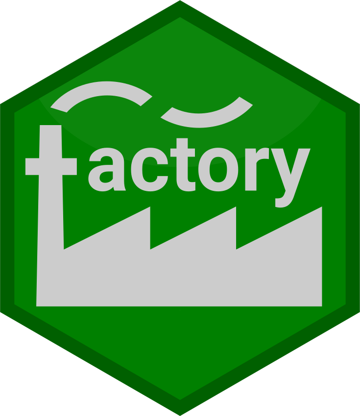

<!-- README.md is generated from README.Rmd. Please edit that file -->

# factory 

<!-- badges: start -->

[](https://www.tidyverse.org/lifecycle/#maturing)
[](https://travis-ci.org/jonthegeek/factory)
[](https://ci.appveyor.com/project/jonthegeek/factory)
[](https://codecov.io/gh/jonthegeek/factory?branch=master)
<!-- badges: end -->

The goal of factory is to make construction of function factories more
straightforward, without requiring the user to learn the `rlang`
package.

## Installation

You can install factory from [GitHub](https://github.com/) with:

``` r
# install.packages("remotes")
remotes::install_github("jonthegeek/factory")
```

## Motivation

Function factories are functions that make functions. They can be
confusing to work with. For example, they can produce functions that are
fragile (examples from [Advanced R by Hadley Wickham (2nd
Edition), 10.2.3: Forcing
Evaluation](https://adv-r.hadley.nz/function-factories.html#forcing-evaluation),
“Gah” comments are me):

``` r
power1 <- function(exponent) {
  function(x) {
    x^exponent
  }
}

x <- 2
square1 <- power1(x)

x <- 3
square1(2) # Gah, fragile!
#> [1] 8
```

You can make factories that are less fragile, if you remember to `force`
the variables.

``` r
power2 <- function(exponent) {
  force(exponent) # Gah, easy to forget!
  function(x) {
    x^exponent
  }
}

x <- 2
square2 <- power2(x)
x <- 3
square2(2)
#> [1] 4
```

However, the resulting function can be hard to understand:

``` r
square2
#> function(x) {
#>     x^exponent
#>   }
#> <environment: 0x00000000163ec068>
```

You can make functions that are easier to understand, but building the
function factory is much more difficulty (from [Advanced R by Hadley
Wickham (2nd Edition), 19.7.4: Creating
functions](https://adv-r.hadley.nz/quasiquotation.html#new-function)):

``` r
power3 <- function(exponent) {
  rlang::new_function(
    rlang::exprs(x = ), 
    rlang::expr({
      x ^ !!exponent
    }), 
    rlang::caller_env()
  )
}
```

The resulting functions look like a “normal” function, though, and are
thus easier for users to understand:

``` r
square3 <- power3(2)
square3
#> function (x) 
#> {
#>     x^2
#> }
```

The goal of `factory` is to make function factories as straightforward
to create as in `power1`, but to make the resulting functions make as
much sense as in `power3`:

``` r
library(factory)
power4 <- build_factory(
  fun = function(x) {
    x^exponent
  },
  exponent # For the time being, you need to tell factory which arguments belong to the factory.
)

x <- 2
square4 <- power4(x)
x <- 3
square4(2)
#> [1] 4
```

The resulting function is clear, as with power3:

``` r
square4
#> function (x) 
#> {
#>     x^2
#> }
```
